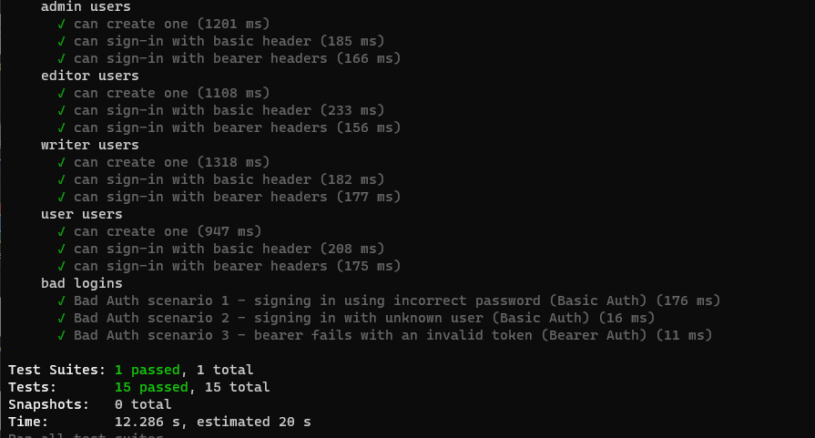
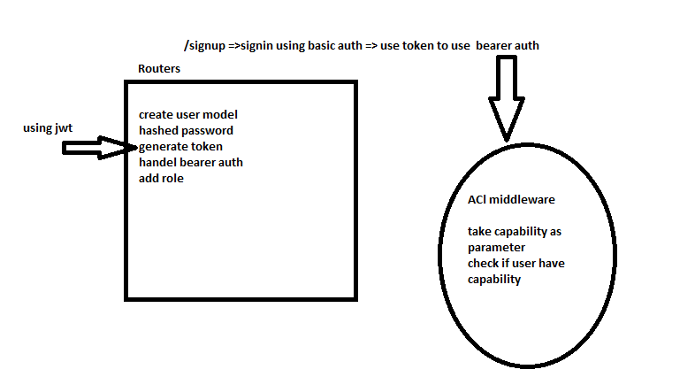

# auth-api

[Action](https://github.com/AseelAlasaad/auth-api/actions)

[PR](https://github.com/AseelAlasaad/auth-api/pull/1)

[heroku](https://api-auth-main.herokuapp.com/)
# test 

Test Unit, npm run test 

# Run app 

nodemon index.js

**note**

use .env file put inside it PORT number and DATABASE_URL, SECRET

# UML

